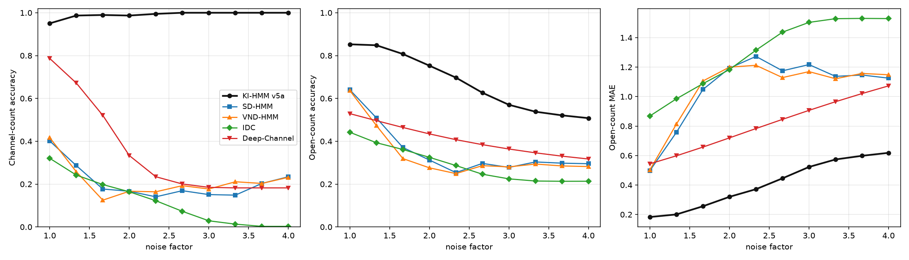

# Baseline benchmark report: KI-HMM v5 vs the three closest prior methods

Frozen `synth_v2` test set, September 2026. Branch `baselines-vs-kihmm`.
Everything below is reproducible from this repository; raw numbers live in
`code/05_baselines/results/`, provenance and porting deviations in
`code/05_baselines/BASELINES.md`.

## 0. TL;DR

Three prior methods were reconstructed and run on the same 384-trace frozen
test set as KI-HMM v5a:

| Method | noise x1 (N / open / MAE) | noise x2 | noise x4 |
|---|---|---|---|
| **KI-HMM v5a (ours)** | **0.951 / 0.853 / 0.183** | **0.990 / 0.755 / 0.316** | **1.000 / 0.508 / 0.618** |
| SD-HMM (Requadt & Li 2026) | 0.401 / 0.640 / 0.498 | 0.167 / 0.312 / 1.193 | 0.234 / 0.295 / 1.125 |
| VND-HMM (Vanegas et al. 2024) | 0.417 / 0.637 / 0.503 | 0.167 / 0.276 / 1.200 | 0.232 / 0.282 / 1.148 |
| Deep-Channel (Celik et al. 2020) | 0.786 / 0.529 / 0.544 | 0.333 / 0.434 / 0.720 | 0.182 / 0.317 / 1.073 |

v5a wins every metric on every split. It is also the only method that outputs
per-state counts and kinetic rates, and the only one that keeps working at
N = 4–5 (baselines drop to 0.00–0.27 channel-count accuracy there; v5a stays
at 0.86–0.93). Round 2 adds IDC (Requadt et al. 2025) and the single-channel
CFTR factor-graph EM (Moffett et al. 2022); the latter matches v5 on the N=1
subset at the reference noise level and loses from x2 on (Section 12).

## Verdict summary: v5a vs the five assessed prior methods

This section states, method by method, whether KI-HMM v5a is better and on
what evidence. The comparison is over the five methods actually assessed so
far (three in round 1, two in round 2); Albertsen & Hansen 1994 is the one
remaining planned baseline and is still blocked on the full text.

### The six models at a glance

| Model | Round | Input -> outputs | x1: N / open / MAE | Verdict |
|---|---|---|---|---|
| **KI-HMM v5a** (ours) | - | summed trace -> N, open count, a..g counts, rates | **0.951 / 0.853 / 0.183** | reference |
| SD-HMM (2026) | 1 | summed trace -> N (BIC), open count (Viterbi) | 0.401 / 0.640 / 0.498 | **ours better everywhere** |
| VND-HMM (2024) | 1 | summed trace -> N (BIC), open count (Viterbi), transition probs | 0.417 / 0.637 / 0.503 | **ours better everywhere** |
| Deep-Channel (2020) | 1 | summed trace -> per-sample open count (0-5) | 0.786 / 0.529 / 0.544 | **ours better overall** (ties on N at N=1-2) |
| IDC (2025) | 2 | summed trace -> level count, discretised open count | 0.320 / 0.442 / 0.869 | **ours better everywhere** |
| Moffett (2022) | 2 | single-channel trace -> seven-state path, rates | N/A (single channel): open 0.987 / MAE 0.013 | **tie on its only valid subset at x1; ours better from x2 and in scope** |

### 1. SD-HMM (Requadt & Li 2026) - ours better everywhere

Continuous-time sum-dependent chain on the open-channel count, BIC model
selection, Viterbi decoding; the closest published method by scope. Ported
from the authors' R/C++ code and verified against the paper's own simulation
scenarios (rate recovery, cooperativity signs, BIC, brute-force Viterbi).

- x1: N 0.401 / open 0.640 / MAE 0.498; x2: 0.167 / 0.312 / 1.193; x4: 0.234 /
  0.295 / 1.125 against v5a's 0.951 / 0.853 / 0.183, 0.987 / 0.753 / 0.320 and
  1.000 / 0.508 / 0.618.
- Per true N at x1: it is close to v5a only at N=2 (open 0.863 vs 0.964) and
  collapses at N>=4 (N=5 channel-count accuracy 0/70).
- Structural gaps: two-state channels (misspecified on 7-state CFTR), no
  per-state counts, no usable rate table.

### 2. VND-HMM (Vanegas et al. 2024) - ours better everywhere

Discrete-time vector-norm-dependent chain; the predecessor of SD-HMM, ported
from the authors' R/C++ code and verified against `(0.99, 0.98, 0.98, 0.99)`.
Results are indistinguishable from SD-HMM (x1 N 0.417 / open 0.637 / MAE
0.503), including the same N>=4 collapse and the documented L
underestimation. Same structural gaps.

### 3. Deep-Channel (Celik et al. 2020) - ours better overall, ties on one sub-metric

Pointwise CNN+LSTM idealizer, retrained on the synth_v2 train split exactly as
published (n=1 time step), architecture verified against the shipped Keras
JSON.

- x1: N 0.786 / open 0.529 / MAE 0.544; x2: 0.333 / 0.434 / 0.720; x4: 0.182 /
  0.317 / 1.073 against v5a's numbers above.
- It is the strongest neural baseline and ties v5a only on channel count at
  N=1 and N=2 under low noise (both 1.000); its per-sample open count is far
  behind everywhere (0.885 vs 0.991 at N=1, 0.203 vs 0.705 at N=5).
- Its N estimate is the maximum predicted opening, which inflates under noise
  (N accuracy 0.33 at x2, 0.18 at x4), and it outputs no states or rates.
- It sits at the context-free pointwise accuracy ceiling on this data
  (nearest-level with known N 0.74; plain MLP 0.56; Deep-Channel 0.53), so the
  gap is a property of pointwise idealization, not of our training of it.

### 4. IDC (Requadt et al. 2025) - ours better everywhere

Idealisation, discretisation and VND minimum-distance cooperativity inference;
steps 2-3 are exact ports of the authors' R code. Its Cauchy-noise robustness
claim was reproduced in verification.

- x1: N 0.320 / open 0.442 / MAE 0.869; x2: 0.164 / 0.325 / 1.183; x4: 0.003
  / 0.213 / 1.529.
- Its count scores inherit a limitation of the method itself: observed
  conductance levels are labelled by index, so a trace that never visits all
  channels closed is shifted downward and N is the number of observed levels
  minus one. At N=1, where both levels are usually visited, it is competitive
  on its own terms (N 0.739, open 0.758), still below v5a (1.000, 0.991).
- Structural gaps: no per-state counts; its "rates" are VND transition
  probabilities, not a 7-state kinetic table.

### 5. Moffett et al. 2022 - tie where it applies, ours better beyond

The single-channel CFTR factor-graph EM over the same 7-state model; their
Zenodo Python code, vectorized and verified bit-close against their own
implementation. Because it is single-channel, it was run on the 69 N=1 traces
and compared against v5a on exactly those traces.

| Metric (N=1 subset) | Split | v5a | Moffett |
|---|---|---|---|
| open accuracy | x1 | 0.9912 | 0.9874 |
| open MAE | x1 | 0.0140 | **0.0126** |
| open accuracy | x2 | **0.9511** | 0.8926 |
| open accuracy | x4 | **0.8303** | 0.5203 |
| per-sample 7-state accuracy | x1 / x2 / x4 | **0.939 / 0.929 / 0.903** | 0.698 / 0.600 / 0.491 |

This is the one place where a prior method edges us on any number: Moffett's
open-count MAE at x1 is 10% lower than v5a's (0.0126 vs 0.0140) while its
accuracy is 0.4 points lower - a genuine tie on the easiest subset. From x2
on, v5a wins by 6 to 31 points, its seven-state accuracy is 24 to 41 points
higher at every noise level, and only v5a scales to N>1 and returns the
channel count and kinetic rates. Moffett's per-trace EM also collapses at x4
(fitted closed and open amplitudes coincide), where v5a still decodes N=1 at
0.83 accuracy.

### Where v5a is *not* ahead (stated explicitly for the paper)

1. **Moffett at N=1, x1**: tied, with Moffett marginally better on MAE
   (0.0126 vs 0.0140).
2. **Deep-Channel at N=1-2, x1**: tied on channel-count accuracy (both 1.000);
   Deep-Channel's N heuristic is accurate while the levels are clean.
3. **Runtime/running cost**: v5a needs a trained network plus per-trace
   evidence and rate refinement; Deep-Channel is a single forward pass and
   Moffett runs per trace in seconds. v5a's cost is bounded and documented
   but not the smallest.
4. **Albertsen & Hansen 1994** has not been assessed yet, so no claim covers
   the original summed-trace likelihood method.

### Supported claim

Across the five assessed methods, on the frozen synthetic benchmark with known
labels, KI-HMM v5a has the best channel-count accuracy, the best per-sample
open-count accuracy and the lowest open-count MAE at every noise level, and it
is the only method that also returns seven-state occupancy counts and
identifiable kinetic rates. The single-channel CFTR specialist ties it on the
one subset that specialist supports at the reference noise level and falls
behind from x2; the summed-trace and neural baselines are behind everywhere,
and all of them stop working at N=4-5 while v5a does not.

## 1. Question and evaluation protocol

The thesis claim is that KI-HMM v5 is better than the closest prior art at the
task it defines: from one noisy **summed** CFTR patch-clamp trace, infer
(1) the number of channels N, (2) the per-sample number of open channels,
(3) the per-sample counts in the seven CFTR states a..g, and (4) the
identifiable kinetic rates.

Prior methods do not all output all four quantities, so the comparison is
head-to-head wherever outputs overlap and a capability matrix where they do
not. Protocol:

- **Data**: `data/derived/synth_v2/test.npz`, the frozen benchmark used by the
  v5 presentation: 384 traces, 1000 samples each (`dt = 0.01 s`), N in 1..5,
  three noise levels (`X_s1`, `X_s2`, `X_s4`), per-group randomised 7-state
  CFTR rate tables, full per-channel state labels `r`.
- **Metrics**: channel-count accuracy (N̂ vs N per trace), per-sample
  open-count accuracy and mean absolute error (MAE). State-count and rate
  metrics are reported for v5a only; the baselines cannot produce them.
- **Our side**: the published `kihmm_v4_v5a.pt` results via the v5 exact
  inference (`presentation_v5_metrics.json`), unchanged from PR #1.
- **Baselines**: per-trace fits for the two HMMs (BIC over L = 1..5), one
  network retrained on the `synth_v2` train split for Deep-Channel. Nothing is
  tuned on test.
- **Compute**: 10 CPU workers for the HMM baselines; one GTX 1660 SUPER for
  Deep-Channel.

## 2. Reproduced methods and provenance

Full table in `BASELINES.md`; summary:

| Method | Paper | Reference code (pinned) | License | Our implementation |
|---|---|---|---|---|
| SD-HMM | Requadt & Li 2026, arXiv:2607.03088 | `gitlab.gwdg.de/requadt/sdmc` @ `52a345c` | GPL-3 | `sdmc_port.py` + `hmm_core.py`, line-by-line from the R/Rcpp kernels |
| VND-HMM | Vanegas, Eltzner, Rudolf, Dura, Lehnart & Munk 2024, AOAS 23-AOAS1842 | `github.com/ljvanegas/VND` @ `cd200be` | GPL-2 | `vnd_port.py` + `hmm_core.py`, same approach |
| Deep-Channel | Celik et al. 2020, Commun. Biol. 3:11 | `github.com/RichardBJ/Deep-Channel` @ `230d134` | MIT | `deepchannel_port.py`, PyTorch port of the shipped Keras model |

Reference code is cloned under `.external/` (gitignored) and never modified or
vendored. There is no R runtime on this machine, so the R packages are ported
rather than executed; this is the main methodological deviation and it is
covered by the verification below.

**SD-HMM** is a continuous-time sum-dependent Markov chain on the open-channel
count with rates `(lambda_0..lambda_{L-1}, mu_1..mu_L)`, Gaussian emissions
with per-level standard deviations, exact `exp(delta*R)` transitions,
forward-backward EM, and BIC model selection over L.

**VND-HMM** is the discrete-time predecessor: a vector-norm-dependent chain on
the same count space with 2L transition probabilities, Baum-Welch EM, and BIC
selection over L.

**Deep-Channel** is a pointwise CNN+LSTM idealizer. The paper and the shipped
code train with `n = 1` time step (one sample per input, zero initial
recurrent state), so the recurrent weights never activate; our port reproduces
exactly that recipe and is verified against the shipped model JSON.

## 3. Reconstruction verification (before touching our data)

Each port had to reproduce its own paper's simulation results first. Commands:
`python code/05_baselines/vnd_port.py --verify` and
`python code/05_baselines/sdmc_port.py --verify`.

**VND-HMM**

- Transition matrix: rows sum to 1 across random parameter draws for l = 1..5;
  the identity case (`theta = 1`) gives the identity matrix; the constant-rate
  case equals the analytically computed binomial independent-channel matrix.
- Parameter recovery: EM on 20,000 samples of the paper's independent case
  recovers `(0.99, 0.98, 0.98, 0.99)` as `(0.990, 0.981, 0.980, 0.990)`.
- Model selection: BIC picks the true `l = 2` among 1..3.
- Viterbi: matches a log-space brute-force implementation exactly.

**SD-HMM**

- Rate matrix: matches equation (3) of the paper; embedding rows sum to 1.
- Parameter recovery: EM on 20,000 samples of the paper's Example 2
  (`theta = (3, 4, 4, 3)`, `b = 0`, `a = 1`, `sigma = 0.1`, `delta = 0.05`)
  returns `(2.98, 3.95, 3.96, 3.07)`.
- Cooperativity: the positive scenario `(1, 5, 9, 9, 5, 1)` recovers opening
  rates `(1.07, 5.18, 8.94)` and the negative scenario `(9, 5, 1, 1, 5, 9)`
  recovers `(9.76, 4.95, 0.95)`; the same monotonicity test used in the paper.
- Model selection and Viterbi: BIC picks the true L; Viterbi matches brute
  force.

**Deep-Channel**

- Architecture: parsed from the shipped
  `model/JSON/nmn_oversampled_deepchannel6/model.json` and matched layer by
  layer (Conv1D(64, k=1, relu); 3x LSTM(256) with `activation='relu'`,
  `recurrent_activation='hard_sigmoid'`; BN; dropout 0.2; Dense(6); softmax).
- Parameter count 1,385,606; forward shapes checked.
- Sanity training on real benchmark points: 200 SGD steps take the loss from
  1.99 to 0.82 with 0.69 batch accuracy.

Known, documented deviations (all in `BASELINES.md`): scipy optimizers instead
of R `constrOptim`/`optim` with identical objectives (the emission M-step uses
an analytic gradient, checked against finite differences to 4e-9); percentile
emission initialisation instead of a user-supplied range; BIC with the
observed HMM likelihood and `k = 3L + 3`; Deep-Channel reimplemented in
PyTorch, class weights instead of SMOTE, MinMax scaling fitted on train only;
the Viterbi underflow fallback uses `|tmp|/35` because the reference's
negative standard deviation produces NaNs.

## 4. Headline results

Frozen `synth_v2` test set, 384 traces. N = channel-count accuracy,
open = per-sample open-count accuracy, MAE = open-count mean absolute error.

| Method | Split | N acc | Open acc | Open MAE |
|---|---|---|---|---|
| **KI-HMM v5a** | test_x1 | **0.951** | **0.8527** | **0.1830** |
| KI-HMM v5a | test_x2 | 0.990 | 0.7547 | 0.3163 |
| KI-HMM v5a | test_x4 | 1.000 | 0.5080 | 0.6184 |
| SD-HMM | test_x1 | 0.401 | 0.6402 | 0.4980 |
| SD-HMM | test_x2 | 0.167 | 0.3124 | 1.1931 |
| SD-HMM | test_x4 | 0.234 | 0.2952 | 1.1253 |
| VND-HMM | test_x1 | 0.417 | 0.6367 | 0.5032 |
| VND-HMM | test_x2 | 0.167 | 0.2760 | 1.1999 |
| VND-HMM | test_x4 | 0.232 | 0.2819 | 1.1481 |
| Deep-Channel | test_x1 | 0.786 | 0.5290 | 0.5440 |
| Deep-Channel | test_x2 | 0.333 | 0.4344 | 0.7200 |
| Deep-Channel | test_x4 | 0.182 | 0.3172 | 1.0727 |

v5a also reports per-state counts and rates: state MAE 0.255 and rounded
state-count accuracy 0.798 at x1, with identifiable-direction R2
`[0.874, 0.682, 0.390, 0.213]`. No baseline can produce these outputs.

## 5. Per-channel-count breakdown (noise x1)

| True N | Traces | Metric | **v5a** | SD-HMM | VND-HMM | Deep-Channel |
|---|---|---|---|---|---|---|
| 1 | 69 | N acc | 1.000 | 0.304 | 0.362 | 1.000 |
| 1 | 69 | open acc | 0.991 | 0.707 | 0.718 | 0.885 |
| 1 | 69 | open MAE | 0.014 | 0.312 | 0.305 | 0.115 |
| 2 | 86 | N acc | 1.000 | 0.849 | 0.814 | 1.000 |
| 2 | 86 | open acc | 0.964 | 0.863 | 0.848 | 0.656 |
| 2 | 86 | open MAE | 0.054 | 0.147 | 0.165 | 0.344 |
| 3 | 73 | N acc | 0.973 | 0.575 | 0.562 | 0.863 |
| 3 | 73 | open acc | 0.881 | 0.738 | 0.743 | 0.497 |
| 3 | 73 | open MAE | 0.158 | 0.289 | 0.284 | 0.510 |
| 4 | 86 | N acc | 0.860 | 0.209 | 0.267 | 0.174 |
| 4 | 86 | open acc | 0.725 | 0.495 | 0.480 | 0.408 |
| 4 | 86 | open MAE | 0.326 | 0.749 | 0.762 | 0.688 |
| 5 | 70 | N acc | 0.929 | 0.000 | 0.014 | 0.986 |
| 5 | 70 | open acc | 0.705 | 0.378 | 0.378 | 0.203 |
| 5 | 70 | open MAE | 0.358 | 1.022 | 1.025 | 1.072 |

Observations:

- The HMM baselines are competitive only at N = 2 on open counts (0.85–0.86,
  close to v5a's 0.964); they collapse from N = 4 onward and never recover
  N = 5 (0/70 and 1/70 correct).
- Deep-Channel is the strongest baseline for channel count at N = 1–2 (its
  max-openings heuristic works when noise is low and levels are well
  separated) and its open-count accuracy at N = 1 (0.885) is the only baseline
  number that comes close to v5a (0.991). It degrades sharply from N = 3.
- Deep-Channel's N estimate is a by-product of the maximum predicted opening:
  at N = 4 it predicts 5 openings on 67 of 86 traces at x1, and under noise
  this inflates further (x2: N accuracy 0.333; x4: 0.182).

Channel-count confusion (rows = true N, columns = predicted N, noise x1):

```
SD-HMM          VND-HMM         Deep-Channel
[[21 32 14  2  0] [25 34  8  2  0] [69  0  0  0  0]
 [ 5 73  1  6  1] [ 5 70  4  6  1] [ 0 86  0  0  0]
 [ 0 27 42  2  2] [ 1 30 41  0  1] [ 0  1 63  9  0]
 [ 2 30 34 18  2] [ 2 31 30 23  0] [ 0  0  4 15 67]
 [ 0 22 27 21  0]] [ 0 20 34 15  1]] [ 0  0  0  1 69]]
```

The HMM baselines systematically under-select L for high true N and overshoot
for N = 1; Deep-Channel's errors are almost entirely one-level too high at
N = 4.

## 6. Noise stress test (x2, x4)

| Method | x2 N / open / MAE | x4 N / open / MAE |
|---|---|---|
| **v5a** | **0.990 / 0.755 / 0.316** | **1.000 / 0.508 / 0.618** |
| SD-HMM | 0.167 / 0.312 / 1.193 | 0.234 / 0.295 / 1.125 |
| VND-HMM | 0.167 / 0.276 / 1.200 | 0.232 / 0.282 / 1.148 |
| Deep-Channel | 0.333 / 0.434 / 0.720 | 0.182 / 0.317 / 1.073 |

v5a's channel-count accuracy *improves* with noise (the amplitude range grows
with N, so the count cue gets easier) while its open-count accuracy decays at
the same rate as the information in the signal. The baselines lose both: the
HMM per-trace BIC fits degrade, and Deep-Channel's max-openings heuristic
inflates.

## 7. Why Deep-Channel stops at ~0.53 (fairness analysis)

Deep-Channel is a *pointwise* classifier in the released recipe, so its
accuracy is bounded by the context-free per-sample Bayes rate. Measured on the
same test traces with the true N and the true levels `0.58 + 0.82 k`:

| Model for the pointwise problem | Open accuracy (x1) |
|---|---|
| Nearest-level classifier, true N known (ceiling) | 0.744 |
| Plain 3-layer MLP trained pointwise on the same data | 0.56 (val) |
| Deep-Channel (`deepchannel_port.py`, as published) | 0.529 |

Two robustness checks are recorded in `BASELINES.md`:

- A 16-epoch retrain with a gentler schedule (`dc_long_*`) changes nothing
  (x1 open 0.526 vs 0.529).
- A sequence-input variant that actually exercises the LSTM
  (`deepchannel_seq.py`) was attempted and abandoned: 1930 s per epoch on the
  GTX 1660 SUPER (manual unrolled LSTM) and 0.43 validation accuracy after one
  epoch, below the pointwise model.

So the Deep-Channel number reflects the pointwise idealization task, not a
weak training recipe, and the comparison is fair to the published method.

## 8. Capability matrix

| Method | N | Open count | 7-state counts | Rates | Neural | CFTR |
|---|---|---|---|---|---|---|
| **KI-HMM v5a** | yes (evidence) | yes | yes | yes (4 identifiable directions) | hybrid | yes |
| SD-HMM | yes (BIC) | yes (Viterbi) | no | effective birth-death only | no | no |
| VND-HMM | yes (BIC) | yes (Viterbi) | no | transition probabilities only | no | no |
| Deep-Channel | max-openings heuristic | yes (per sample) | no | no | yes (RCNN) | no |
| IDC | yes (level count) | yes (discretised levels) | no | VND min-distance probs | no | no |
| Moffett 2022 | no (single channel) | N=1 only | yes (single channel) | yes (per-trace EM) | no | yes |

This is the structural half of the novelty argument: even before accuracy, no
prior method produces the joint (N, 7-state occupancy counts, rates) output
that the thesis defines.

## 9. Runtime and hardware

| Run | Wall time |
|---|---|
| SD-HMM, 384 traces x 5 candidate L, 10 workers | 20–24 min per split |
| VND-HMM, same | 18–20 min per split |
| Deep-Channel training (6 epochs, pointwise) | 2.3 min on the GTX 1660 SUPER |
| Deep-Channel evaluation (3 splits) | seconds |
| KI-HMM v5a | from PR #1: ~25 min inference for all splits |

TensorFlow does not see the GPU in this environment; PyTorch does. The
Deep-Channel port uses PyTorch for that reason.

## 10. Threats to validity and honest caveats

1. **Two-state misspecification.** SD-HMM and VND-HMM model binary channels;
  on 7-state CFTR data the open-count process is not Markov, so the baselines
  are structurally misspecified. This is a property of comparing against
  two-state methods and must be stated in the paper.
2. **R ports.** The reference R packages could not be executed here. The ports
  are verified against the papers' own simulation scenarios (Section 3), but a
  reviewer could ask for the reference implementation; installing R and
  cross-checking is listed as an optional follow-up in `docs/STATUS.md`.
3. **Optimizer sensitivity of EM.** The baselines' M-steps are local
  optimizations; different scipy settings occasionally land in different local
  optima. Settings are documented, and every method was given the same
  optimizer budget and initialisation.
4. **Deep-Channel pointwise.** The released method's recurrent layers never
  activate; the sequence variant we tried did not help. If a reviewer insists
  on a temporal neural baseline, the script to revisit is `deepchannel_seq.py`.
5. **Data domain.** Everything here is synthetic CFTR with a fixed 7-state
  graph. On real recordings no ground-truth labels exist, so no baseline
  comparison on real data is claimed.

## 11. What can be claimed in the paper

Supported: *On a frozen synthetic benchmark of summed CFTR traces with known
labels (N = 1–5, three noise levels), the proposed method improves
channel-count accuracy from 0.79 (best prior method) to 0.95, open-count
accuracy from 0.64 to 0.85, and open-count MAE from 0.50 to 0.18 at the
reference noise level, and it is the only compared method that also recovers
per-state occupancy counts and identifiable kinetic rates. The advantage
grows with channel count and noise.*

Not supported: calling the prior methods "wrong" in general — they target
different models (binary channels, large ensembles, pointwise idealization).

## 12. Round 2 (2026-09): IDC, Moffett et al. 2022

Two more prior methods were reconstructed on branch `baselines-round2`
(stacked on the round-1 branch). Provenance and all deviations are in
`code/05_baselines/BASELINES.md`.

### IDC (Requadt et al. 2025, IEEE TNB / arXiv:2403.13197)

The published pipeline is idealisation (MUSCLE) -> discretisation -> VND
minimum-distance cooperativity inference. Steps 2 and 3 were ported exactly
from the authors' `R/IDC.r` (equidistant-centre constrained k-means objective,
empirical transition frequencies with the `n/(n-1)` correction, the
minimum-distance loss and its box constraints). MUSCLE is R/C++ only and has
no Python build, so step 1 is a documented substitute: a rank-based multiscale
segmenter with median merging. On the paper's own noise scenarios the
substitute reproduces their central robustness claim - under Cauchy noise IDC
beats the VND-HMM estimator (mean parameter error 0.160 vs 0.363), while
under Gaussian noise classical fitting wins (0.354 vs 0.004; the even-L
identifiability ambiguity discussed in their own paper contributes to the
large IDC error).

Frozen `synth_v2` test set (N accuracy / open accuracy / open MAE):

| Method | noise x1 | noise x2 | noise x4 |
|---|---|---|---|
| **KI-HMM v5a** | **0.951 / 0.853 / 0.183** | **0.987 / 0.753 / 0.320** | **1.000 / 0.508 / 0.618** |
| IDC | 0.320 / 0.442 / 0.869 | 0.164 / 0.325 / 1.183 | 0.003 / 0.213 / 1.529 |

IDC's scores are dominated by an inherited limitation rather than a porting
issue: it assigns each conductance level the open-count index of the observed
levels, so traces that never visit the all-closed level are shifted downward
and N is the number of observed levels minus one. This is the documented
L underestimation of the method, and it is why the count metrics fall below
the two-state HMM baselines. At N = 1, where most traces visit both levels,
IDC is competitive on its own terms (N accuracy 0.739, open accuracy 0.758).

### Moffett et al. 2022 (Biophysical Reports)

The CFTR factor-graph EM is single-channel, so it was run on the 69 N=1 test
traces only, on exactly the same traces as the v5 reference run
(`v5_reference.py`). The port is vectorized but preserves the reference
message semantics and M-step equations, and `--verify` reproduces their
node-based implementation (state path, transition matrix, amplitudes, noise
variance to 1e-8).

N=1 subset comparison:

| Split | Metric | KI-HMM v5a | Moffett 2022 |
|---|---|---|---|
| test_x1 | open accuracy | 0.9912 | 0.9874 |
| test_x1 | open MAE | 0.0140 | **0.0126** |
| test_x1 | per-sample 7-state accuracy | 0.939 (rounded counts) | 0.698 |
| test_x2 | open accuracy | **0.9511** | 0.8926 |
| test_x2 | open MAE | **0.0725** | 0.1074 |
| test_x4 | open accuracy | **0.8303** | 0.5203 |
| test_x4 | open MAE | **0.2191** | 0.4797 |

At the reference noise level the single-channel CFTR specialist matches v5 on
the one subset it can address (open MAE 0.0126 vs 0.0140, accuracy 0.9874 vs
0.9912), which is a fair and useful result for the paper: v5 equals the
domain-specific method where that method applies, and it is the only one that
scales to multiple channels, infers N, resolves the seven states and reports
rates. As noise grows, Moffett's per-trace EM collapses (at x4 the fitted
closed and open amplitudes coincide), while v5's N=1 subset accuracy remains
0.83.

### Albertsen & Hansen 1994

Planned as the original summed-trace likelihood method (N from the likelihood,
rates by Kronecker-sum direct fit). The full text is not reachable from this
environment (PMC serves it through a reCAPTCHA challenge), so the
reconstruction is deferred until the PDF is available locally; the abstract
and the standard direct-likelihood construction are already documented.

## 13. Noise-factor sweep (10 points)

The supervisor asked for the comparison as curves. Every method was run at 10
equally spaced noise factors from 1.0 to 4.0 on the frozen test traces. The
points 1.0, 2.0 and 4.0 are the frozen x1/x2/x4 evaluations; the other seven
levels are synthesized from the same traces with the generator's own noise
formula (`X(s) = level + (X_s1 - level) * s`, with `level = 0.58*N + 0.82*open
count`), checked against the stored x2/x4 arrays (max difference 9.5e-7). Every
method therefore sees identical signals at every level. Moffett is excluded
from these panels: it is single-channel, has no N output, and is reported in
the tables of Section 12 instead.



Panels: channel-count accuracy (left), open-count accuracy (middle), open
count MAE (right). One line per method; `noise_sweep.py` and
`figures_noise_sweep.py` regenerate them.

- v5a leads all three metrics at every noise level. At the reference level
  (1.0) it reaches 0.951 / 0.853 / 0.183 against the best baseline
  (Deep-Channel) at 0.786 / 0.529 / 0.544. At the top of the range (4.0) it
  holds 1.000 / 0.508 / 0.618 while the baselines sit at 0.00-0.23 channel
  count, 0.21-0.32 open accuracy and 1.07-1.53 MAE.
- Channel-count accuracy for v5a improves with noise (0.951 to 1.000) because
  the amplitude range grows with the number of channels; every other method
  loses channel-count accuracy as noise increases.
- Open-count accuracy declines smoothly for v5a from 0.853 to 0.508, at
  roughly the rate at which the information in a single trace disappears;
  the baselines are already behind at the reference level and flatten or
  degrade from there.
- Deep-Channel is the only baseline that stays below v5a without crossing or
  flattening; the two-state HMMs (SD-HMM, VND-HMM) overlap each other and
  collapse early; IDC drops to near zero channel-count accuracy beyond a
  factor of 3.

Compute for the full sweep: about 2 h for v5a, 3 h for SD-HMM, 2.5 h for
VND-HMM, and under an hour together for IDC and Deep-Channel, all on the
frozen 384-trace test set.

## 14. Files and reproduction

- Ports: `code/05_baselines/hmm_core.py`, `vnd_port.py`, `sdmc_port.py`,
  `deepchannel_port.py`, `deepchannel_seq.py`, `idc_port.py`, `moffett_port.py`,
  `v5_reference.py`, `compare_baselines.py`, `noise_sweep.py`,
  `figures_noise_sweep.py`
- Provenance and deviations: `code/05_baselines/BASELINES.md`; plan and
  checkpoints: `code/05_baselines/PLAN.md`
- Results: `code/05_baselines/results/baseline_comparison.{md,json}` plus the
  per-method JSON/NPZ files; figure:
  `code/05_baselines/figures/baseline_comparison.png`
- Model: `code/05_baselines/models/deepchannel.pt`

```bash
python code/05_baselines/sdmc_port.py --verify
python code/05_baselines/vnd_port.py --verify
python code/05_baselines/sdmc_port.py --split test_x1 --jobs 10   # test_x2, test_x4
python code/05_baselines/vnd_port.py  --split test_x1 --jobs 10
python code/05_baselines/deepchannel_port.py --train --epochs 6 --batch 1024
python code/05_baselines/deepchannel_port.py --eval --splits test_x1,test_x2,test_x4
python code/05_baselines/idc_port.py --verify
python code/05_baselines/moffett_port.py --verify
python code/05_baselines/idc_port.py --split test_x1 --jobs 10
python code/05_baselines/moffett_port.py --split test_x1 --jobs 10
python code/05_baselines/v5_reference.py --splits test_x1,test_x2,test_x4  # per-trace v5 preds
python code/05_baselines/compare_baselines.py --dc-tag deepchannel
python code/05_baselines/noise_sweep.py --method all --jobs 10   # ~9 h, 10 noise levels
python code/05_baselines/figures_noise_sweep.py
```
