# KI HMM v5: channel count, seven states, and rates from summed CFTR signals

**Mohammadreza Kazemi** · York University
> KI HMM v5 reads one summed CFTR current trace. It returns the number of channels, the number of open channels at each sample, the count in each of seven CFTR states, and the rate values that can be measured from the signal.
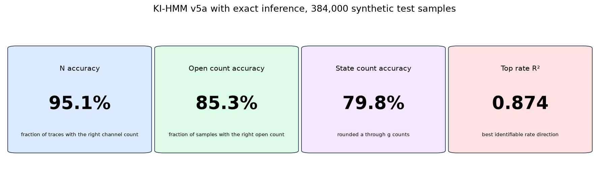
## Research question
A patch clamp recording may contain several channels at once. The electrode records their total current. It does not show which channel is open or which CFTR state it occupies.
The model must recover four outputs from that one noisy trace:
1. The total number of channels, N.
2. The number of open channels at every sample.
3. The count in each CFTR state, a through g, at every sample.
4. The rate values that the summed signal can support.
## Model
The current model is a hybrid neural HMM:
1. Neural networks predict the first N, noise, and rate values.
2. A learned probability model scores the signal.
3. Exact HMM math finds the hidden states.
4. A search chooses N.
5. Adam improves rates during inference.
It is trained with gradients, but some steps are fixed math rather than neural layers.
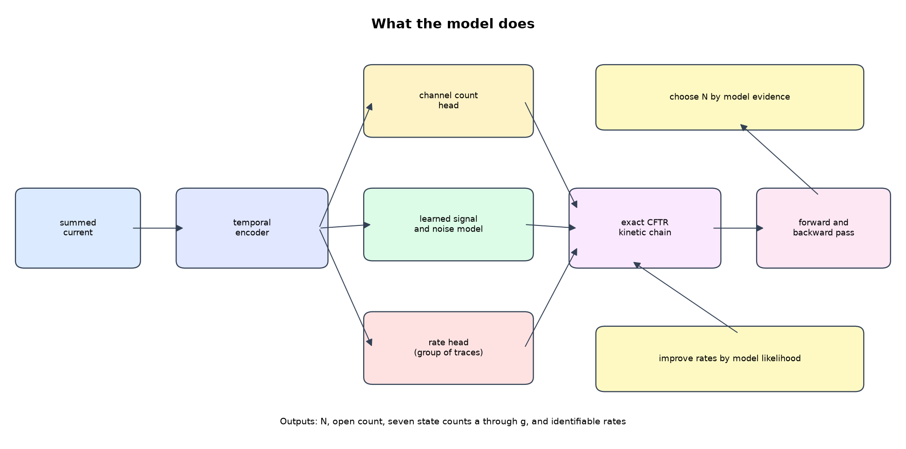
The first image is the short view. The full path below labels every learned and fixed step.
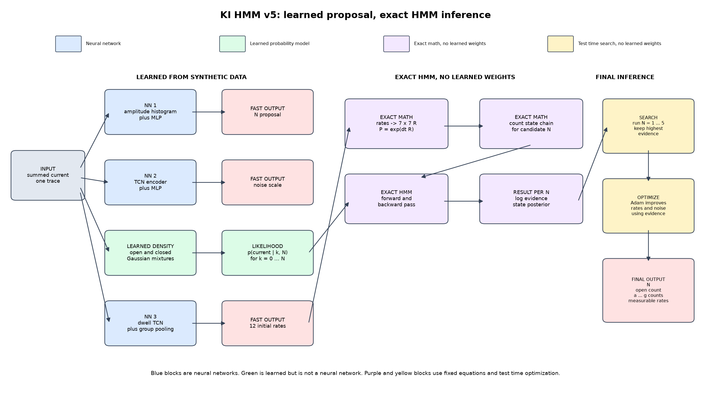
Blue blocks are neural networks. Green is a learned probability model, but it is not a neural network. Purple blocks use fixed HMM equations. Yellow blocks run a search or an optimizer at test time.
| Step | What it does | Type |
| --- | --- | --- |
| 1 | Amplitude histogram and MLP give a fast N proposal | Neural network |
| 2 | TCN and MLP estimate the noise scale | Neural network |
| 3 | Dwell TCN, group pooling, and MLP estimate 12 rates | Neural network |
| 4 | Gaussian mixtures give the likelihood of each open count | Learned probability model, not a neural network |
| 5 | Matrix exponential builds the seven state CFTR transition matrix | Exact math, no learned weights |
| 6 | The count state chain and forward backward pass give the hidden state posterior | Exact HMM, no learned weights |
| 7 | The model runs N = 1 through 5 and keeps the highest evidence | Test time search, not a neural network |
| 8 | Adam adjusts rates and noise to improve the evidence | Test time optimization, not a neural network |
| 9 | The final HMM pass returns N, open count, a through g, and measurable rates | Final output |
The neural network gives a fast first answer. The exact HMM checks that answer against the CFTR rules and the recorded current.
## Test data and metrics
All accuracy numbers below use the frozen synthetic test set. It contains 384 traces and 384,000 labeled samples. N ranges from 1 to 5. Every trace has true labels for N, open count, all seven states, and the rates.
- N accuracy is the fraction of traces with the correct channel count.
- Open count accuracy is the fraction of samples with the exact number of open channels.
- Open count MAE is the average absolute error in open channels.
- State count MAE is the average absolute error across a through g.
- State count accuracy rounds each predicted state count, then checks if it equals the true count.
- Rate R2 measures how much of the true rate change the model recovers. Only four rate directions carry enough information in a summed trace.
### Total synthetic test results
| Metric | Result |
| --- | --- |
| Traces | 384 |
| Labeled samples | 384,000 |
| N accuracy | 95.1% |
| Open count accuracy | 85.3% |
| Open count MAE | 0.183 channels |
| State count accuracy | 79.8% |
| State count MAE | 0.255 channels |
| Top rate direction R2 | 0.874 |
## Predicted values beside true values
Each example below is a full ten second trace. The first plot is the input current. The second plot places the true and predicted open counts on the same axis. The green and red strip marks each right and wrong sample. The last two plots show the true and predicted values for all seven states.
### One channel
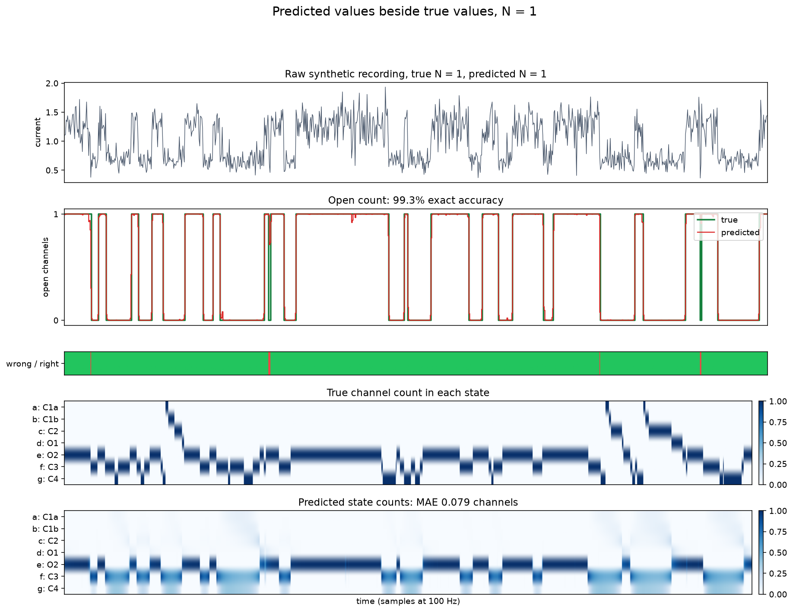
For N = 1, the total test accuracy is 100.0% for N and 99.1% for open count. State count MAE is 0.088 channels.
### Two channels
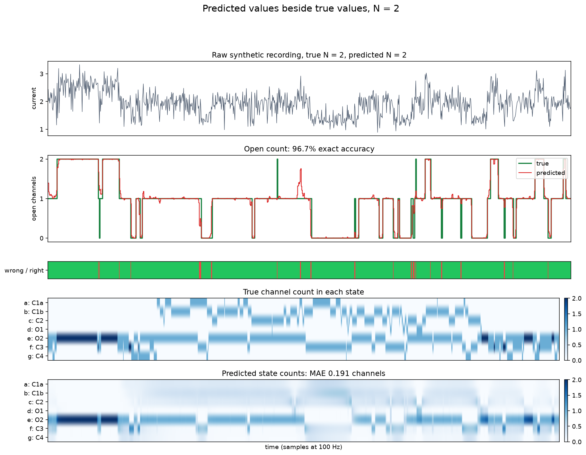
For N = 2, the total test accuracy is 100.0% for N and 96.4% for open count. State count MAE is 0.179 channels.
### Three channels
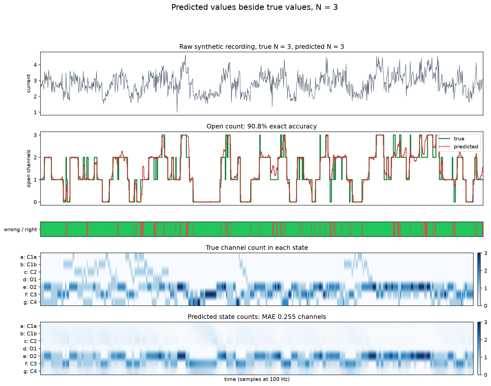
For N = 3, the total test accuracy is 97.3% for N and 88.1% for open count. State count MAE is 0.257 channels.
### Four channels
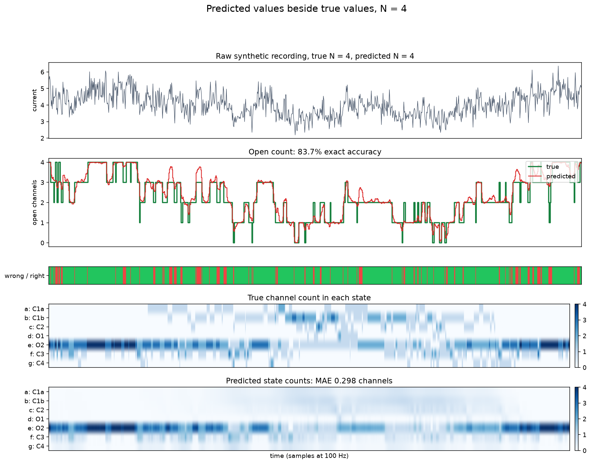
For N = 4, the total test accuracy is 86.0% for N and 72.5% for open count. State count MAE is 0.346 channels.
### Five channels
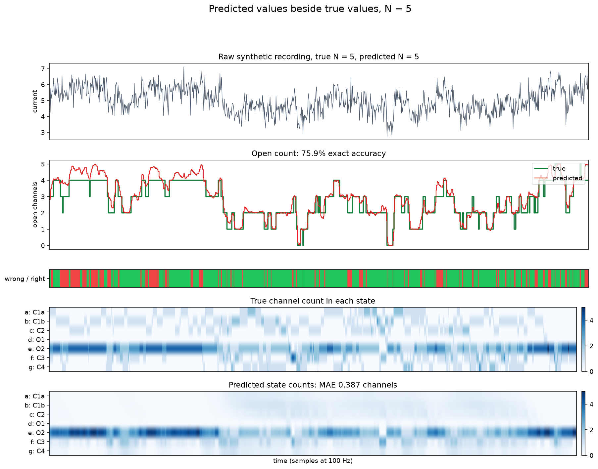
For N = 5, the total test accuracy is 92.9% for N and 70.5% for open count. State count MAE is 0.397 channels.
## Results by channel count
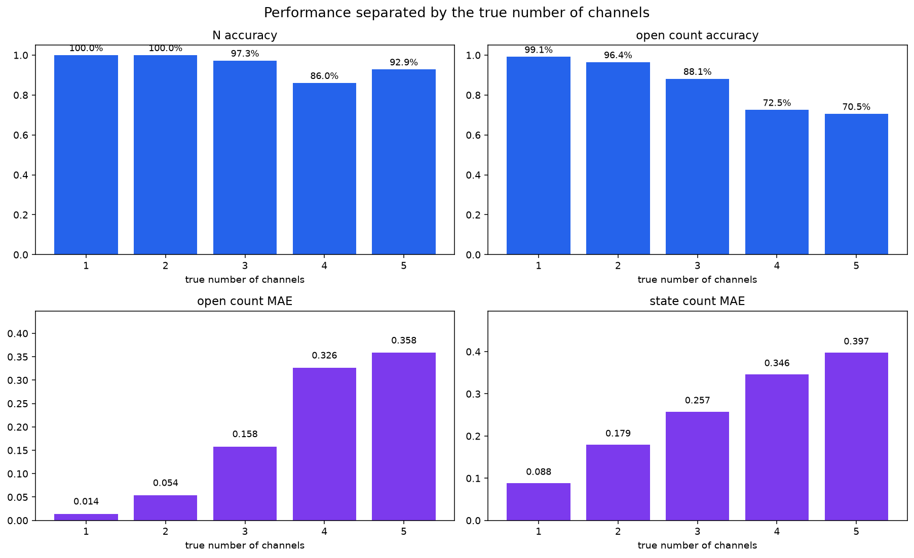
| True N | Traces | N accuracy | Open accuracy | Open MAE | State accuracy | State MAE |
| --- | --- | --- | --- | --- | --- | --- |
| 1 | 69 | 100.0% | 99.1% | 0.014 | 93.9% | 0.088 |
| 2 | 86 | 100.0% | 96.4% | 0.054 | 86.9% | 0.179 |
| 3 | 73 | 97.3% | 88.1% | 0.158 | 79.8% | 0.257 |
| 4 | 86 | 86.0% | 72.5% | 0.326 | 70.8% | 0.346 |
| 5 | 70 | 92.9% | 70.5% | 0.358 | 67.9% | 0.397 |
The main loss appears at N = 4 and N = 5. More channels create more overlapping current levels. N = 4 is confused with N = 5 in 11 of 86 traces.
## Channel count N
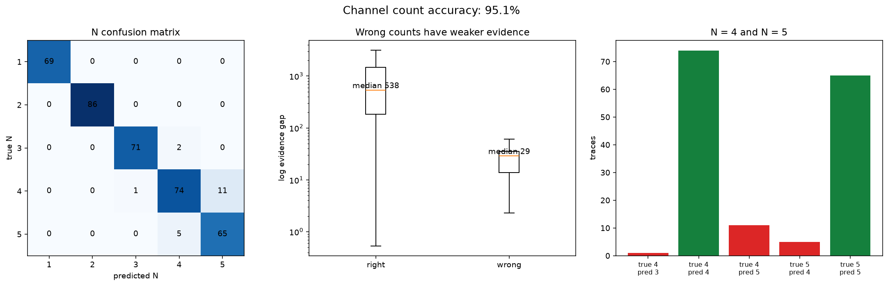
The model gets N right on 365 of 384 traces. It is perfect at N = 1 and N = 2. Every wrong result is off by one channel. Correct results have a median evidence gap of 538. Wrong results have a median gap of 29, so the model is less certain when it misses.
## Number of open channels
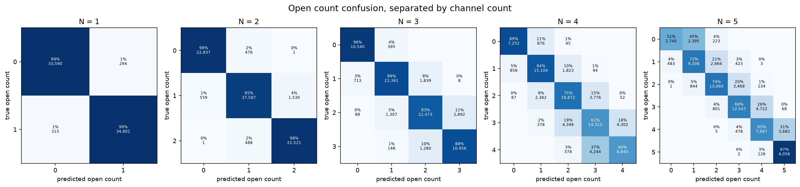
Each panel shows the true open count against the predicted open count for one value of N. The percentage is calculated within each true open count. The model stays close to the diagonal. Errors grow as more current levels overlap.
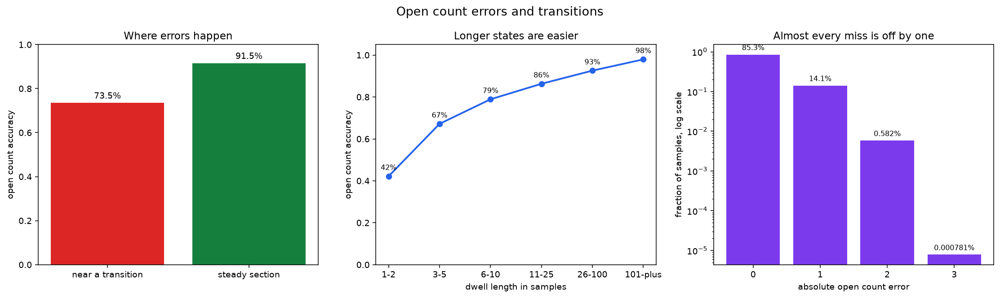
Most errors occur near a state change. Accuracy is 73.5% near a transition and 91.5% in steady sections. Short states are harder. Accuracy rises from 42% for states lasting one or two samples to 98% for states lasting more than 100 samples. Of all 56,575 wrong samples, 54,336 are off by one open channel.
## Seven state counts
The seven outputs are a = C1a, b = C1b, c = C2, d = O1, e = O2, f = C3, and g = C4. The predicted counts always sum to N.
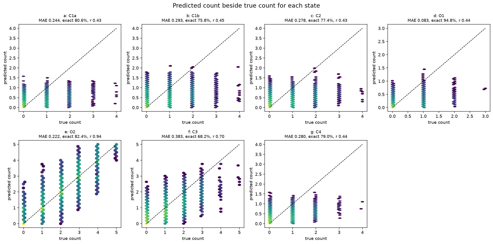
The diagonal is perfect prediction. O2 is the strongest state output because it carries most of the open current. Closed states share the same current level, so the signal gives less direct information about which closed state is active.
| State | Name | True mean | Predicted mean | MAE | Rounded accuracy | Correlation |
| --- | --- | --- | --- | --- | --- | --- |
| a | C1a | 0.192 | 0.177 | 0.244 | 80.6% | 0.434 |
| b | C1b | 0.255 | 0.244 | 0.293 | 75.8% | 0.452 |
| c | C2 | 0.235 | 0.207 | 0.278 | 77.4% | 0.432 |
| d | O1 | 0.056 | 0.054 | 0.083 | 94.8% | 0.445 |
| e | O2 | 1.475 | 1.528 | 0.222 | 82.4% | 0.940 |
| f | C3 | 0.572 | 0.588 | 0.383 | 68.2% | 0.696 |
| g | C4 | 0.219 | 0.225 | 0.280 | 79.0% | 0.443 |
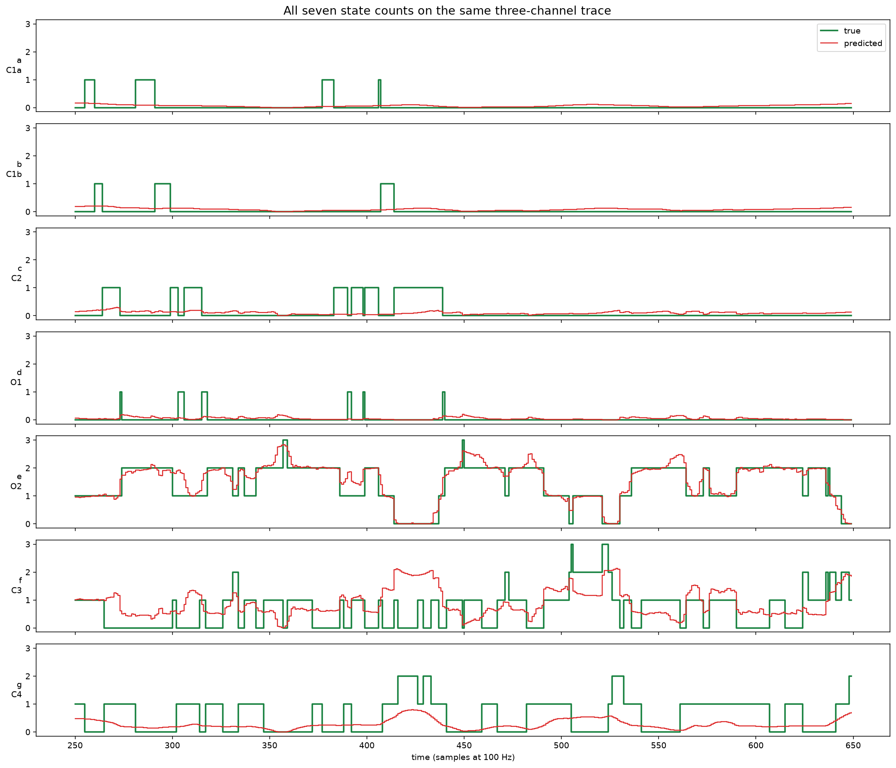
This plot uses one three channel trace. Green is true. Red is predicted. The model follows O2 closely. The split among closed states is smoother and less exact because those states have the same recorded level.
## Rate recovery
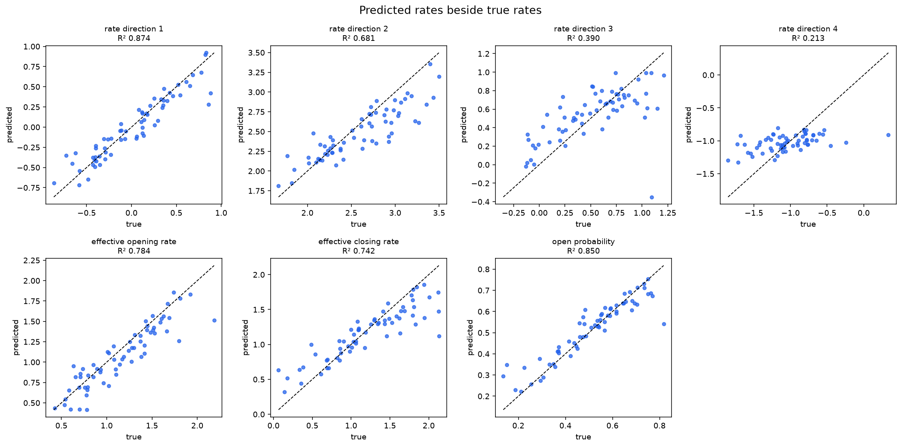
A summed trace cannot support all twelve rates separately. Fisher analysis finds four measurable rate directions. The model recovers those directions with R2 values of 0.874, 0.681, 0.390, and 0.213.
| Rate result | R2 |
| --- | --- |
| Identifiable direction 1 | 0.874 |
| Identifiable direction 2 | 0.681 |
| Identifiable direction 3 | 0.390 |
| Identifiable direction 4 | 0.213 |
| Effective opening rate | 0.784 |
| Effective closing rate | 0.742 |
| Open probability | 0.850 |
Rate values outside these measurable directions should not be treated as separate findings.
## Noise test
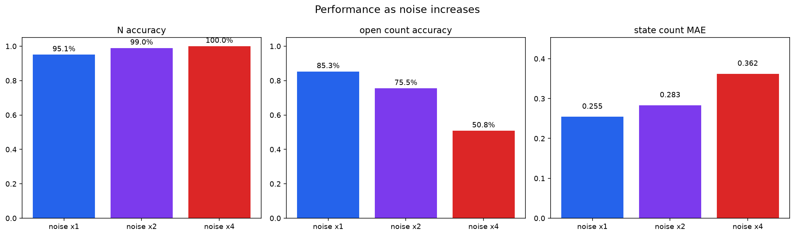
| Noise | N accuracy | Open accuracy | Open MAE | State MAE |
| --- | --- | --- | --- | --- |
| x1 | 95.1% | 85.3% | 0.183 | 0.255 |
| x2 | 99.0% | 75.5% | 0.316 | 0.283 |
| x4 | 100.0% | 50.8% | 0.618 | 0.362 |
N remains easy because the full amplitude range grows with channel count. The sample level state output falls as noise hides the gap between nearby current levels.
## Real recordings
> Real recordings do not have true N, state, or rate labels. These plots show model output, not measured accuracy. All accuracy numbers on this page come from synthetic data with known labels.
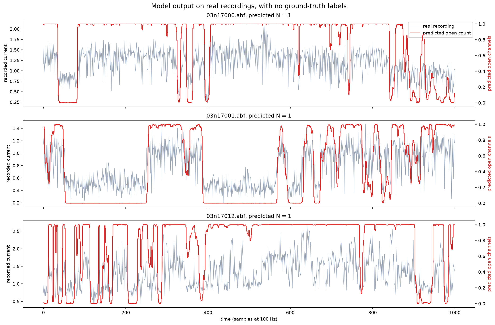
The gray line is recorded current. The red line is the predicted open count. These are examples of model output only.
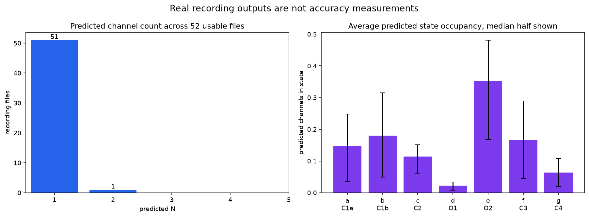
The model processed 52 usable files. It predicted N = 1 for 51 files and N = 2 for one file. The right panel shows average predicted state occupancy across files. Rate output is omitted because rate transfer to real data has not been shown to be reliable.
## Limits
- Accuracy falls for N = 4 and N = 5 because more current levels overlap.
- The five closed states share the same current level. Their individual counts are less certain than the total open count.
- Very short states and transition samples are harder than steady sections.
- High noise lowers open count and state accuracy.
- Only four rate directions can be measured from the summed signal.
- Real data has no labels, so the real plots are not a validation result.
## Reproduce the results
The code is in [morekaccino/denoising-ion-channels](https://github.com/morekaccino/denoising-ion-channels).
```bash
python code/04_ml/presentation_results.py
python code/04_ml/figures_presentation_v5.py
python code/04_ml/presentation_real_v5.py
```
---
## Literature review
> No exact match was found. However, several parts of KI HMM v5 were done before. The new part is the full combination, not each method on its own.
### Full comparison matrix
Yes means the paper directly covers that item. Partial means it covers only part of it or uses a related output. No means it does not cover that item.
| Work | Year | Summed current | Unknown N | More than 2 states | State output at each sample | Rates | Neural | CFTR |
| --- | --- | --- | --- | --- | --- | --- | --- | --- |
| KI HMM v5, this work | 2026 | Yes | Yes | Yes | Yes | Yes | Yes | Yes |
| [Albertsen and Hansen](https://doi.org/10.1016/S0006-3495(94)80613-7) | 1994 | Yes | Yes | Yes | No | Yes | No | No |
| [Klein, Timmer, and Honerkamp](https://pubmed.ncbi.nlm.nih.gov/9333349/) | 1997 | Yes | Partial | No | Partial | Yes | No | No |
| [Csanády](https://doi.org/10.1016/S0006-3495(00)76636-7) | 2000 | Yes | No | Yes | Partial | Yes | No | Partial |
| [Milescu, Akk, and Sachs](https://doi.org/10.1529/biophysj.104.053256) | 2005 | Yes | Yes | Yes | No | Yes | No | No |
| [Stepanyuk, Borisyuk, and Belan](https://doi.org/10.1371/journal.pone.0029731) | 2011 | Yes | Yes | Yes | No | Yes | No | No |
| [Bernstein and Sheldon](https://proceedings.mlr.press/v51/bernstein16.html) | 2016 | Yes | No | Yes | Yes | Yes | No | No |
| [Deep Channel, Celik et al.](https://doi.org/10.1038/s42003-019-0729-3) | 2020 | Yes | Partial | No | Partial | No | Yes | No |
| [Moffett et al.](https://doi.org/10.1016/j.bpr.2022.100083) | 2022 | No | No | Yes | Yes | Yes | No | Yes |
| [Vanegas et al.](https://doi.org/10.1214/23-AOAS1842) | 2024 | Yes | Yes | No | Partial | Yes | No | No |
| [Oikonomou et al.](https://doi.org/10.1038/s42004-024-01369-y) | 2024 | No | No | Yes | No | Yes | Yes | No |
| [Berghaus et al.](https://arxiv.org/abs/2406.06419) | 2024 | No | No | Yes | Partial | Yes | Yes | No |
| [Requadt et al., IDC](https://doi.org/10.1109/TNB.2025.3532441) | 2025 | Yes | Partial | No | Partial | Yes | No | No |
| [Requadt and Li, SDMC](https://arxiv.org/abs/2607.03088) | 2026 | Yes | Yes | Partial | Partial | Yes | No | No |
### Detailed notes
| Work | Data | What it estimates | Main difference from KI HMM v5 |
| --- | --- | --- | --- |
| [Albertsen and Hansen, 1994](https://doi.org/10.1016/S0006-3495(94)80613-7) | Noisy summed traces from several channels | N and transition rates for two and three state models | No neural model, no seven state CFTR output, no state count path at every sample |
| [Klein, Timmer, and Honerkamp, 1997](https://pubmed.ncbi.nlm.nih.gov/9333349/) | Unfiltered noisy multichannel traces | Per channel current levels and opening and closing rates | Two state channels, no seven state occupancy output, no neural model |
| [Csanády, 2000](https://doi.org/10.1016/S0006-3495(00)76636-7) | Multichannel recordings converted to dwell histograms | Single channel rate constants | N is supplied as input. It uses idealized events rather than the raw trace. It does not return the state count path |
| [Milescu, Akk, and Sachs, 2005](https://doi.org/10.1529/biophysj.104.053256) | Macroscopic currents under stimulation | N, conductance, model size, topology, and rates | Uses mean and variance across stimulated currents, not a small N summed trace with sample level state output |
| [Stepanyuk, Borisyuk, and Belan, 2011](https://doi.org/10.1371/journal.pone.0029731) | Macroscopic currents from many channels | N, conductance, and rates for a known seven state model | Uses repeated stimulation and a Gaussian process approximation. It does not return the hidden occupancy count at every sample |
| [Bernstein and Sheldon, 2016](https://proceedings.mlr.press/v51/bernstein16.html) | Noisy aggregate state count vectors | Transition matrix | The full count vector is observed. Patch clamp gives one scalar current instead |
| [Deep Channel, Celik et al., 2020](https://doi.org/10.1038/s42003-019-0729-3) | Patch clamp traces with up to five simultaneous events | Open and closed event idealization | Neural event detection only. It does not infer seven CFTR states or rates |
| [Moffett et al., 2022](https://doi.org/10.1016/j.bpr.2022.100083) | Single channel CFTR traces | Seven CFTR microstates and transition rates | Single channel only. It does not infer N or separate several summed channels |
| [Vanegas et al., 2024](https://doi.org/10.1214/23-AOAS1842) | Noisy superimposed channel signals | N, open count dynamics, rates, and channel dependence | Two state channels, no CFTR microstates, no neural model |
| [Oikonomou et al., 2024](https://doi.org/10.1038/s42004-024-01369-y) | Idealized single channel dwell histograms | HMM topology and transition rates | Neural rate inference, but single channel input and no N or seven state occupancy path |
| [Berghaus et al., 2024](https://arxiv.org/abs/2406.06419) | Noisy observations of Markov jump processes | Rate matrix and initial state distribution | Ion channel example is one three state channel after a separate state grouping step |
| [Requadt et al., 2025](https://doi.org/10.1109/TNB.2025.3532441) | Superimposed voltage clamp recordings | Channel dependence and two state rate values | Two state channels, idealization first, no neural model, no CFTR state counts |
| [Requadt and Li, 2026](https://arxiv.org/abs/2607.03088) | Noisy pooled channel recordings | N, rates, and channel cooperation by HMM likelihood | Binary main model with a general math extension. No neural signal model and no seven state CFTR count path |
### What was already known
1. Multichannel transition rates can be estimated from summed current. Albertsen and Hansen showed this in 1994.
2. N can be selected by likelihood. This also appears in the 1994 work and later macroscopic current methods.
3. The hidden state can be written as the number of channels in each microscopic state. Csanády used this count vector in 2000.
4. Seven state models, N, and rates can be fit from macroscopic currents. Stepanyuk and colleagues showed this in 2011.
5. Neural networks have already been used for patch clamp event detection and rate inference.
6. Recent HMM work estimates N and rates from pooled two state channel signals.
### What still appears different
No paper found in this search combines all of the following:
1. Unknown N from one noisy summed trace with a small number of channels.
2. Seven CFTR state counts at every sample.
3. Open count at every sample.
4. Identifiable rate values from the same recording group.
5. A learned signal and noise model.
6. An exact CFTR count state HMM inside the model.
7. N selection by the model evidence.
8. Rate and noise improvement through the same model likelihood.
### Claim that is supported
> We found no prior method that jointly infers channel count, time resolved seven state CFTR occupancy counts, and identifiable kinetic rates from a noisy summed multichannel trace using learned emissions and exact differentiable HMM inference.
This wording is safer than calling the method the first. The search did not cover every unpublished thesis, private codebase, or paper in every language.
### Claims that are not supported
Do not claim that this work is:
1. The first HMM for multichannel patch clamp data.
2. The first method to estimate rates from summed channel recordings.
3. The first count state Markov chain.
4. The first method to estimate N and rates together.
5. The first neural method for patch clamp signals.
6. The first neural method to estimate ion channel rates.
### Survey scope
This search was completed on 21 September 2026. It covered PubMed, PMC, Biophysical Journal, PLOS, Nature, IEEE, NeurIPS, JMLR, arXiv, and references already collected in this project. It is a focused novelty survey, not a formal systematic review.
